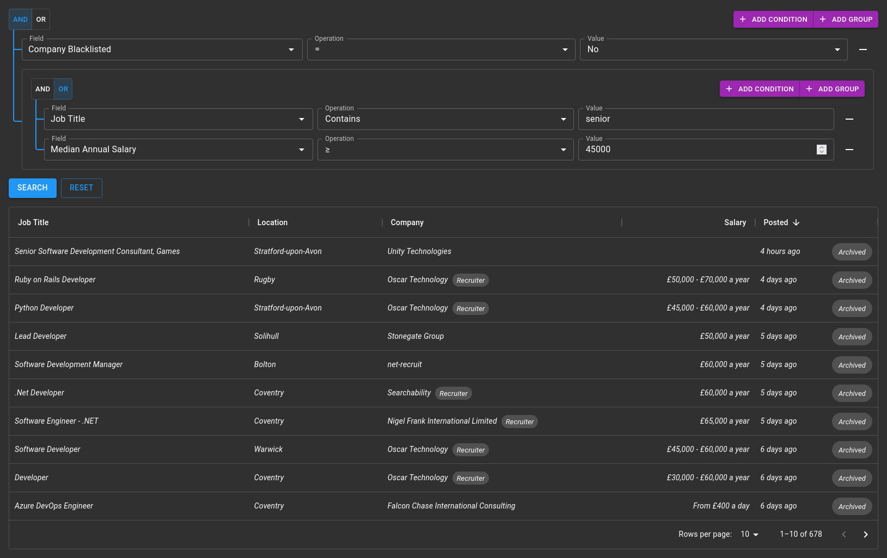

# o-data-grid
ODataGrid is an extension to the [MUI DataGrid](https://github.com/mui-org/material-ui-x) React component which implements features such as sorting, pagination, column selection, and filtering using the [OData Standard](https://www.odata.org/). This allows you to quickly create a powerful interface for browsing data with minimal back-end code.

## Features
- Supports DataGrid and DataGridPro
- (Almost) drop-in replacement for DataGrid
- Fully customisable
- Performant & responsive
- Supports sorting, pagination, column selection and filtering (dynamic or static filter)
- Powerful and intuitive filter/query builder built-in
- Supports custom query string parameters for filtering to allow filters which are not natively supported by OData
- Integrates with browser history - sorting, page navigation and filtering all create new browser history states which are restored when navigating back/forward.
- Responsive column hiding - show or hide columns based on screen size

## Demo
Coming soon!

## API
The ODataGrid API is very similar to the standard [DataGrid](https://mui.com/api/data-grid/data-grid/)/[DataGridPro](https://mui.com/api/data-grid/data-grid-pro/) APIs, with a few additions and removals.

### ODataGridProps/ODataGridProProps
The props are the same as the standard DataGrid props with the following changes:

_* = required property_
#### Modifications
| Name | Change | Description |
| ---- | ------ | ----------- |
| `columns*` | Type | See [ODataGridColDef](#ODataGridColDef) |
| `rows` | Removed | Handled internally |
| `autoPageSize` | Removed | Not supported |
| `disableColumnFilter` | Removed | Not supported - default filtering is replaced |
| `filterMode` | Removed | Not supported  - default filtering is replaced |
| `filterModel` | Removed | Not supported - default filtering is replaced |
| `loading` | Removed | Handled internally |
| `onFilterModelChange` | Removed | Not supported - default filtering is replaced |
| `onPageChange` | Removed | Handled internally |
| `onPageSizeChange` | Removed | Handled internally |
| `page` | Removed | Handled internally |
| `pageSize` | Removed | Handled internally |
| `paginationMode` | Removed | Handled internally |
| `rowCount` | Removed | Handled internally |
| `sortingMode` | Removed | Handled internally |
| `sortModel` | Removed | Handled internally |

#### New Properties

| Name | Type | Default | Description |
| ---- | ---- | ------- | ----------- |
| `url*` | `string` | | URL of the OData endpoint |
| `alwaysSelect` | `string[]` | | Array of entity properties to add to the `$select` clause of the query, even if a column doesn't exist for that property or the column is not visible. |
| `defaultPageSize` | `number` | `10` | The default page size to use. |
| `defaultSortModel` | `GridSortModel` | | The default property/properties to sort by. |
| `disableFilterBuilder` | `boolean` | | Disable the filter/query builder if set to `true` |
| `disableHistory` | `boolean` | | Disable the browser history integration for sorting and pagination if set to `true`.   **Note: this does not disable history integration for the filter builder.** |
| `$filter` | `string` | | Static value to use for the `$filter` clause of the query. **Note: this also has the effect of setting `disableFilterBuilder` to `true`**. |
| `filterBuilderProps` | [FilterBuilderProps](#FilterBuilderProps) | | Props to be passed to the FilterBuilder. |
| `idField` | `string` | | The DataGrid requires that each row in the grid has a property called `id`. If the unique ID field of your entity is not named `id`, provide the name of it here and the value of the property will be copied to `id` in the rows. |

### <a id="ODataGridColDef">ODataGridColDef</a>
The column definition is again similar to the standard [GridColDef](https://mui.com/components/data-grid/columns/).

#### Modifications
| Name | Change | Description |
| ---- | ------ | ----------- |
| `filterOperators` | Type | Type changed to `Operation[]` |
| `hide` | Type | Type changed to `boolean \| Partial<Record<Breakpoint, boolean>>` to support responsive column hiding. |
| `sortComparator` | Removed | Not supported |

#### New Properties

_* = not applicable to collection fields_
| Name | Type | Default | Description |
| ---- | ---- | ------- | ----------- |
| `autocompleteGroup` | `string` | | Group the field should be placed under in the field selection dropdown |
| `caseSensitive` | `boolean` | | If set to `true`, all string operations on the field will be case sensitive. Otherwise `tolower()` is called on all string operations. |
| `collection*` | `boolean` | | Indicates this column is a collection, i.e. is an array. Enables the "Any", "All" and "Count" options. |
| `collectionFields` | `ODataGridColDef` | | Column definitions for the subfields of the collection. Any properties marked with * are not supported. |
| `datePickerProps` | [DatePickerProps](https://mui.com/api/date-picker/) | | Props to pass to the `DatePicker` component for columns with type `date` |
| `dateTimePickerProps` | [DateTimePickerProps](https://mui.com/api/date-time-picker/) | | Props to pass to the `DateTimePicker` component for columns with type `datetime` |
| `filterable` | `boolean` | | Hides the field and does not allow filtering in the FilterBuilder when set to `false`. |
| `filterField` | `string` | | If the field name is different to the field which should be used for filtering, provide the field for filtering here. See also: `filterType`. |
| `filterOperators` | `Operation[]` | `["eq", "ne", "gt", "lt", "ge", "le", "contains", "null", "notnull"]` | Array of supported filter operations for the field. |
| `filterType` | `string` | | If the type of the field to be filtered is different to that of the displayed field, provide the type here. See also: `filterField`. |
| `getCustomFilterString` | `(op: Operation, value: any) => string` | | Function to generate a custom filter string for use in the `$filter` clause. |
| `getCustomQueryString` | `(op: Operation, value: any) => ({ [key: string]: string })` | | Function to generate a custom set of query string values to add to the OData request. Allows custom filtering to be performed which is not supported by OData. |
| `label` | `string` | Defaults to the same value as `headerName` or `field` | Text to be displayed in the field selection dropdown. |
| `nullable` | `boolean` | | Adds an "Unknown" option to the value dropdown for columns with type `boolean` if set to `true`. |
| `selectProps` | `{ selectProps?: SelectProps, formControlProps?: FormControlProps, label?: string }` | | Props to pass to the `Select`, `FormControl` and `Label` components for columns which render a `Select` component in the filter. See also: `textFieldProps`. |
| `sortField` | `string` | | If the name of the field to sort by is different to that of the displayed field, provide the name for sorting by here. |
| `textFieldProps` | [TextFieldProps](https://mui.com/api/text-field/) | | Props to pass to the `TextField` component for columsn which render a `TextField` in the filter. See also: `selectProps`. |
| `renderCustomInput` | `(value: any, setValue: (v: any) => void) => React.ReactNode` | | Function to render a custom component for the "Value" input of the filter. The component should read the value from `value` and use `setValue` to change the value of the filter. See also: `renderCustomFilter`. |
| `renderCustomFilter` | `(value: any, setValue: (v: any) => void) => React.ReactNode` | | Function to render a custom component for filter. The component should read the value from `value` and use `setValue` to change the value of the filter. This overrides the "Operation" input as well as the "Value" input. See also: `renderCustomInput`. |

### <a id="FilterBuilderProps">FilterBuilderProps</a>