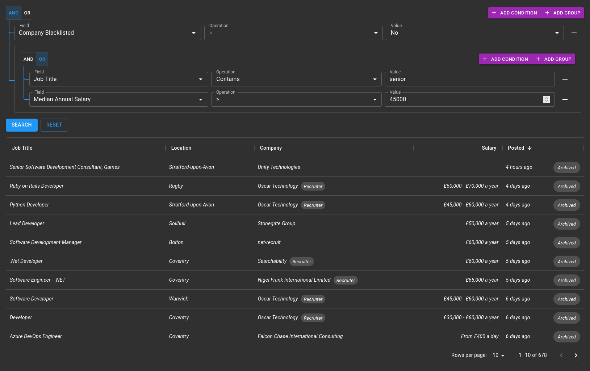

# ODataGrid
ODataGrid is an extension to the [MUI DataGrid](https://github.com/mui-org/material-ui-x) React component which implements features such as sorting, pagination, column selection, and filtering using the [OData Standard](https://www.odata.org/). This allows you to quickly create a powerful interface for browsing data with minimal back-end code.



## Features
- Supports DataGrid and DataGridPro
- (Almost) drop-in replacement for DataGrid
- Fully customisable
- Performant & responsive
- Supports sorting, pagination, column selection and filtering (dynamic or static filter)
- Powerful and intuitive filter/query builder built-in
- Supports custom query string parameters for filtering to allow filters which are not natively supported by OData
- Integrates with browser history - sorting, page navigation and filtering all create new browser history states which are restored when navigating back/forward.
- Responsive column visibility - show or hide columns based on screen size

## Demo
Coming soon!

## Notes
ODataGrid is still in the fairly early stages of development. I'm not aware of any issues currently, but it hasn't been battle-tested. It also utilises [Recoil](https://github.com/facebookexperimental/Recoil) for state management in the filter builder, which is still considered experimental by Facebook.

Please report any issues that you find, and feel free to make feature requests. This will help to make ODataGrid better.

## Usage
Usage is very similar to the regular DataGrid. For the most basic scenario simply change the `DataGrid`/`DataGridPro` to the corresponding `ODataGrid`/`ODataGridPro` component, add the `url` property, and remove any unsupported properties.

From there you can start to customise the grid to your needs using the properties available in the API below.

**Note: like the DataGrid you should ensure that the `columns` property keeps the same reference between renders.**

If the same reference is not kept, this may trigger duplicate OData requests.

### Helpful Tips
- Nested properties are supported, to define a column for a nested property flatten it as you would for the query string. E.g. to access `Child` from `{ Parent: { Child: "foo" } }`, use `Parent/Child` as the value for `field` in the column definition.

### Examples
The demo site isn't ready yet, but you can see some examples of usage here on my GitHub:
- [Simple example utilising the static `$filter` filter](https://github.com/jamerst/JobHunt/blob/master/jobhunt/client/src/views/Dashboard.tsx#L39)
- More advanced examples utilising the `FilterBuilder`:
    - [1](https://github.com/jamerst/JobHunt/blob/master/jobhunt/client/src/views/Jobs.tsx#L63)
    - [2](https://github.com/jamerst/JobHunt/blob/master/jobhunt/client/src/views/Companies.tsx#L54)

## API
The ODataGrid API is very similar to the standard [DataGrid](https://mui.com/api/data-grid/data-grid/)/[DataGridPro](https://mui.com/api/data-grid/data-grid-pro/) APIs, with a few additions and removals.

### ODataGridProps/ODataGridProProps
The props are the same as the standard DataGrid props with the following changes:

_* = required property_
#### Modifications
| Name | Change | Description |
| ---- | ------ | ----------- |
| `columns*` | Type | See [`ODataGridColDef`](#ODataGridColDef) |
| `rows` | Removed | Handled internally |
| `autoPageSize` | Removed | Not supported |
| <a id="columnVisibilityModel">`columnVisibilityModel`</a> | Type | Changed to `{ [key: string]: boolean \| Partial<Record<Breakpoint, boolean>> }` to support responsive column visibility<br/><br/>**Note: providing a value will cause the `hide` property to be ignored on all column definitions.** |
| `disableColumnFilter` | Removed | Not supported - default filtering is replaced |
| `filterMode` | Removed | Not supported  - default filtering is replaced |
| `filterModel` | Removed | Not supported - default filtering is replaced |
| `loading` | Removed | Handled internally |
| `onFilterModelChange` | Removed | Not supported - default filtering is replaced |
| `onPageChange` | Removed | Handled internally |
| `onPageSizeChange` | Removed | Handled internally |
| `page` | Removed | Handled internally |
| `pageSize` | Removed | Handled internally |
| `paginationMode` | Removed | Handled internally |
| `rowCount` | Removed | Handled internally |
| `sortingMode` | Removed | Handled internally |
| `sortModel` | Removed | Handled internally |

#### New Properties

| Name | Type | Default | Description |
| ---- | ---- | ------- | ----------- |
| `url*` | `string` | | URL of the OData endpoint |
| `alwaysSelect` | `string[]` | | Array of entity properties to add to the `$select` clause of the query, even if a column doesn't exist for that property or the column is not visible. |
| `defaultPageSize` | `number` | `10` | The default page size to use. |
| `defaultSortModel` | `GridSortModel` | | The default property/properties to sort by. |
| `disableFilterBuilder` | `boolean` | | Disable the filter/query builder if set to `true` |
| `disableHistory` | `boolean` | | Disable the browser history integration for sorting and pagination if set to `true`. <br/> **Note: this does not disable history integration for the filter builder.** |
| `$filter` | `string` | | Static value to use for the `$filter` clause of the query.<br/><br/>**Note: this also has the effect of setting `disableFilterBuilder` to `true`**. |
| `filterBuilderProps` | [`FilterBuilderProps`](#FilterBuilderProps) | | Props to be passed to the FilterBuilder. |
| `idField` | `string` | | The DataGrid requires that each row in the grid has a property called `id`. If the unique ID field of your entity is not named `id`, provide the name of it here and the value of the property will be copied to `id` in the rows. |

### <a id="ODataGridColDef">ODataGridColDef</a>
The column definition is again similar to the standard [GridColDef](https://mui.com/components/data-grid/columns/).

#### Modifications
| Name | Change | Description |
| ---- | ------ | ----------- |
| `filterOperators` | Type | Type changed to `Operation[]` |
| `hide` | Type | Type changed to `boolean \| Partial<Record<Breakpoint, boolean>>` to support responsive column hiding.<br/><br/>**Note: usage not recommended, use [`columnVisibilityModel`](#columnVisibilityModel) instead. This property will be deprecated in the future.** |
| `sortComparator` | Removed | Not supported |

#### New Properties

_* = not applicable to collection fields_
| Name | Type | Default | Description |
| ---- | ---- | ------- | ----------- |
| `autocompleteGroup` | `string` | | Group the field should be placed under in the field selection dropdown |
| `caseSensitive` | `boolean` | | If set to `true`, all string operations on the field will be case sensitive. Otherwise `tolower()` is called on all string operations. |
| `collection*` | `boolean` | | Indicates this column is a collection, i.e. is an array. Enables the "Any", "All" and "Count" options. |
| `collectionFields` | `ODataGridColDef` | | Column definitions for the subfields of the collection. Any properties marked with * are not supported. |
| `datePickerProps` | [`DatePickerProps`](https://mui.com/api/date-picker/) | | Props to pass to the `DatePicker` component for columns with type `date` |
| `dateTimePickerProps` | [`DateTimePickerProps`](https://mui.com/api/date-time-picker/) | | Props to pass to the `DateTimePicker` component for columns with type `datetime` |
| `filterable` | `boolean` | | Hides the field and does not allow filtering in the FilterBuilder when set to `false`. |
| `filterField` | `string` | | If the field name is different to the field which should be used for filtering, provide the field for filtering here. See also: `filterType`. |
| `filterOperators` | `Operation[]` | `["eq", "ne", "gt", "lt", "ge", "le", "contains", "null", "notnull"]` | Array of supported filter operations for the field. |
| `filterType` | `string` | | If the type of the field to be filtered is different to that of the displayed field, provide the type here. See also: `filterField`. |
| `getCustomFilterString` | `(op: Operation, value: any) => string` | | Function to generate a custom filter string for use in the `$filter` clause. |
| `getCustomQueryString` | `(op: Operation, value: any) => ({ [key: string]: string })` | | Function to generate a custom set of query string values to add to the OData request. Allows custom filtering to be performed which is not supported by OData. |
| `label` | `string` | Defaults to the same value as `headerName` or `field` | Text to be displayed in the field selection dropdown. |
| `nullable` | `boolean` | | Adds an "Unknown" option to the value dropdown for columns with type `boolean` if set to `true`. |
| `selectProps` | `{ selectProps?: SelectProps, formControlProps?: FormControlProps, label?: string }` | | Props to pass to the `Select`, `FormControl` and `Label` components for this column in the filter. See also: `textFieldProps`. |
| `sortField` | `string` | | If the name of the field to sort by is different to that of the displayed field, provide the name for sorting by here. |
| `textFieldProps` | [`TextFieldProps`](https://mui.com/api/text-field/) | | Props to pass to the `TextField` component in the filter for this column. See also: `selectProps`. |
| `renderCustomInput` | `(value: any, setValue: (v: any) => void) => React.ReactNode` | | Function to render a custom component for the "Value" input of the filter. The component should read the value from `value` and use `setValue` to change the value of the filter. See also: `renderCustomFilter`. |
| `renderCustomFilter` | `(value: any, setValue: (v: any) => void) => React.ReactNode` | | Function to render a custom component for filter. The component should read the value from `value` and use `setValue` to change the value of the filter. This overrides the "Operation" input as well as the "Value" input. See also: `renderCustomInput`. |

### <a id="FilterBuilderProps">FilterBuilderProps</a>
| Name | Type | Default | Description |
| ---- | ---- | ------- | ----------- |
| `autocompleteGroups` | `string[]` | | Array of groups for field selection dropdown (used for setting group order) |
| `autocompleteProps` | [`AutocompleteProps`](https://mui.com/api/autocomplete/#props) | | Props to pass to the `Autocomplete` component used for the field and collection field dropdowns |
| `datePickerProps` | [`DatePickerProps`](https://mui.com/api/date-picker/#props) | | Props to pass to the `DatePicker` component used for the value input for columns of type `date` |
| `datePickerProps` | [`DatePickerProps`](https://mui.com/api/date-time-picker/#props) | | Props to pass to the `DateTimePicker` component used for the value input for columns of type `datetime` |
| `disableHistory` | `boolean` | | Disables browser history integration if set to `true` |
| `filter` | `SerialisedGroup` | | Allows setting the state of the FilterBuilder using a `SerialisedGroup`. You could use this to implement filter saving and restoring.<br/><br/>Changing the value of this property will cause `restoreState` to be called, but with the `state` property undefined. |
| `localeText` | [`FilterBuilderLocaleText`](#FilterBuilderLocaleText) | | Localization strings for `FilterBuilder` (see [Localization](#localization) section) |
| `localizationProviderProps` | [`LocalizationProviderProps`](https://mui.com/components/date-picker/#localization) | | Props to pass to the `LocalizationProvider` component for the `DatePicker` and `DateTimePicker` components |
| `onSubmit` | `(filter: string, serialised: SerialisedGroup \| undefined, queryString: QueryStringCollection \| undefined) => (void \| any)` | | Function called when FilterBuilder is submitted (e.g. when the search button is clicked). You should use this to trigger the OData request.<br/><br/>`filter` is the OData filter string, `serialised` is a serialised form of the query which can be used to load the query back into the filter builder. |
| `onRestoreState` | `(filter: string, serialised: SerialisedGroup \| undefined, queryString: QueryStringCollection \| undefined, state?: any) => void` | | Function called when the state of the FilterBuilder is restored (e.g. from history navigation). You should also use this to trigger the OData request alongside the `onSubmit` callback.<br/><br/>`state` is the the value of `history.state` that the query was restored from. `state` will be undefined if the call is as a result of the `filter` property changing. |
| `searchMenuItems` | `({ label: string, onClick: () => void })[]` | | Array of entries to add to the dropdown menu next to the Search button of the `FilterBuilder` |

## Localization
The `FilterBuilder` component supports localization like the `DataGrid` through the `localeText` property. See below for the translation keys and their default values:
```
{
  and: "And",
  or: "Or",

  addCondition: "Add Condition",
  addGroup: "Add Group",

  field: "Field",
  operation: "Operation",
  value: "Value",
  collectionOperation: "Operation",
  collectionField: "Field",

  search: "Search",
  reset: "Reset",

  opAny: "Has at least one",
  opAll: "All have",
  opCount: "Count",

  opEq: "=",
  opNe: "≠",
  opGt: ">",
  opLt: "<",
  opGe: "≥",
  opLe: "≤",
  opContains: "Contains",
  opNull: "Is Blank",
  opNotNull: "Is Not Blank"
}
```

## Development
ODataGrid is developed using [pnpm](https://pnpm.io/). It will probably work fine with npm too, but this hasn't been tested.

To build and run the packages, you first need to install the development packages by running `pnpm i` in the `packages` directory. Once you have done that you can build or run the relevant package.

### Building
Building is simple, just run `pnpm build` in the relevant directory under `packages`.

The build output is in the `build` directory.

### Running Locally
For ease of testing, each package has a basic dev site included. To start it run `pnpm start`. This is only a front-end server, you will have to modify the app in `dev` to point to an OData service of your choice, and add the correct column schema.